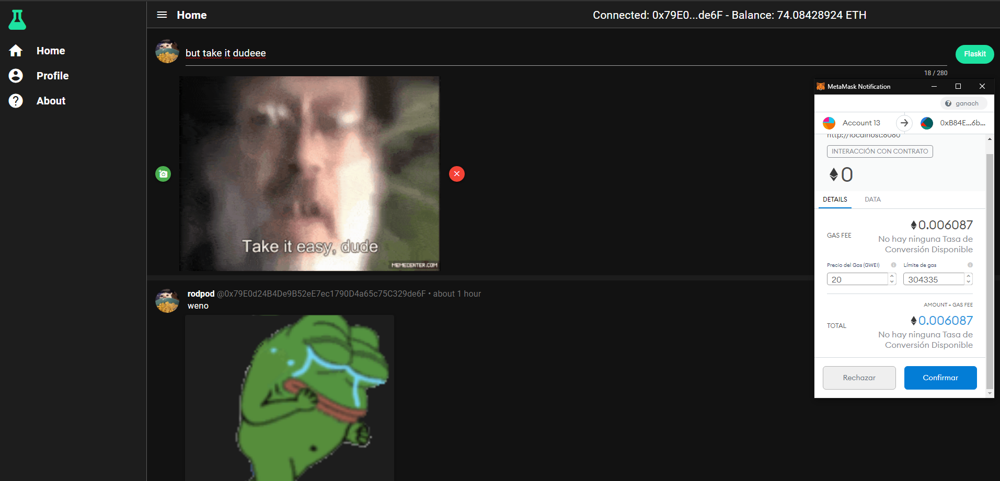

# DePhi (dephi)
## Decentralized Philanthropy

A decentralized  ''''Cross-Platrom Twitter'''' (you need Metamask chrome extension so... no) clone where likes are tips in Ethers!  
Created with Quasar Framework, VueJS & Ethereum Blockchain.

Your profile data will be forever uploaded, and so are all of your posts, even you won't be able to take them down.  
They will allways be waiting for a tip to your wallet...

1. About to flask.

2. Flasked.

3. Tipping.

4. Tipped.


#### WIP TODO
- loaders
- redo timeline -> done -> consume post events and tip events.
- tip in profile
- tip stats in profile

- Backend ?

## Setup
- Install Metamask
- Install Ganache
- Install Truffle js cli
## Install the dependencies
```bash
npm install
```
## Compile smart contracts
```bash
truffle compile
```

## Deploy smart contracts
```bash
truffle migrate --reset
```
## Web Version

### Start  in development mode
```bash
quasar dev
```

### Build for production
```bash
quasar build
```
